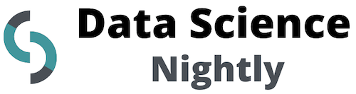

 

Learn. Do. Iterate.

---

---

## 🚀 Mission
Data Science Nightly (DSN) is an ensemble of modern tutorials, apps and resources on a variety of Data Science topics for beginners, intermediates and experts.

## 💡 Motivation
Creation and curation of high quality, hands-on and relevant content.

> Educating is part of Learning

## 🛠️ Contribution
Please create a [Discussion](https://github.com/vopani/datasciencenightly/discussions/categories/topics) to request for content on a particular topic.

Please create an [Issue](https://github.com/vopani/datasciencenightly/issues) for any improvements, suggestions or errors in the content.

## 📋 License
This project is licensed under the [Apache License 2.0](#LICENSE)
